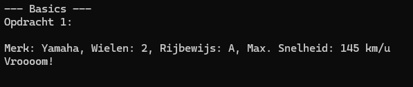
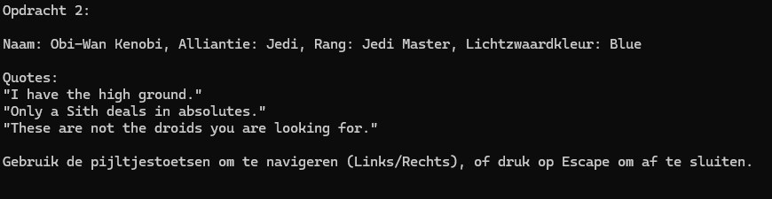
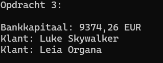

# Classes-5---Basics

In deze oefening ga je aan aan de slag met klassen in een Console applicatie. Haal stap voor stap de code uit commentaar in de `Main` methode om te valideren of je code werkt.

## Opdracht 1: Vehicle

Schrijf een klasse `Vehicle` met de volgende eigenschappen:
- `NumberOfWheels` (int) - Let op: Zorg er voor dat de waarde van NumberOfWheels altijd groter is dan nul. Indien een waarde kleiner dan of gelijk aan nul wordt toegewezen aan NumberOfWheels, dan stel je de waarde gelijk aan vier.
- `Brand` (string)
- `DriverLicense` (string)
- `MaxSpeed` (int) - Let op: Zorg er voor dat de waarde van MaxSpeed altijd groter dan of gelijk is aan nul. Wanneer een negatieve waarde wordt toegewezen aan MaxSpeed, dan neem je de absolute waarde van dit getal.

Schrijf ook de volgende methodes:
- `string DescribeVehicle()`: Geeft een beschrijving van het voertuig terug.
- `string Drive()`: Geeft het geluid terug dat het voertuig maakt.

**Voorbeeldgebruik in `Main`**:
```csharp
Vehicle vehicle = new Vehicle { NumberOfWheels = 2, Brand = "Yamaha", DriverLicense = "A", MaxSpeed = 145 };
Console.WriteLine(vehicle.DescribeVehicle());
Console.WriteLine(vehicle.Drive());
```



---

## Opdracht 2: StarWarsCharacter
Schrijf een klasse `StarWarsCharacter` met de volgende eigenschappen:

- `Name` (string)
- `Alliance` (string, bijv. "Jedi" of "Sith")
- `Rank` (string, bijv. "Padawan", "Jedi Master", "Sith Lord")
- `LightSaberColor` (string, bijv. "Blue", "Red", "Green", "Purple")
- `Quotes` (List van string) - Let Op: Zorg er voor dat Quotes altijd een lege lijst krijgt toegewezen.

Schrijf ook de volgende constructors:
- Een constructor zonder parameters die een standaard instantie maakt van Luke Skywalker.
- Een constructor met de parameters: Name, Alliance, Rank, LightSaberColor (zonder Quotes).

Gebruik constructor chaining om duplicate code te vermijden.

Schrijf ook de volgende methodes:
- `string DescribeCharacter()`: Geeft een beschrijving van het karakter terug.
- `void ShowQuotes()`: Toont alle quotes van het karakter in de console.

**Code in `Main`**:
Haal de code voor Opdracht 2 in de `Main` methode uit commentaar om je oplossing te testen.



> [!NOTE]
> Bonusopdracht:
- Voeg een methode `void AddQuote(string quote)` toe om nieuwe quotes toe te voegen.
- Maak een methode `bool IsSith()` die `true` retourneert als het karakter tot de Sith behoort.

Veel succes, young Padawan! 🌟

---

## Opdracht 3: Associaties
### Person
Schrijf een klasse `Person` met de volgende eigenschappen:
- `FirstName` (string)
- `LastName` (string)
- `DateOfBirth` (DateTime)
- `IsMan` (boolean)
### Transaction
Schrijf een klasse `Transaction` met de volgende eigenschap:
- `Amount` (double) - Let op - Zorg er voor dat deze waarde altijd wordt afgerond op twee cijfers na de komma wanneer een waarde wordt toegewezen met de setter.

Schrijf een constructor voor `Transaction` met één parameter: Amount.

### BankAccount
Schrijf een klasse `BankAccount` met de volgende eigenschappen:
- `Owner` (Persoon)
- `AccountNumber` (string)
- `Transaction` (List van Transaction) - Let Op: Zorg er voor dat deze lijst altijd geïnitialiseerd is met een lege List bij het aanmaken van een nieuwe instantie.

Schrijf de volgende methodes:
- `void AddTransaction(Transaction transactie)`: Voegt een transactie toe.
- `double Saldo()`: Geeft het huidige saldo. Bereken dit door alle bedragen van elke transactie met elkaar op te tellen.

### Bank
Schrijf een klasse `Bank` met de volgende eigenschappen:
- `Customers` (List van BankAccount) - Let Op: Zorg er voor dat deze lijst altijd geïnitialiseerd is met een lege List bij het aanmaken van een nieuwe instantie.
- `Name` (string)

Schrijf de volgende methodes:
- `List<string> GetAllCustomers()`: Geeft een lijst met klantennamen.
- `void AddCustomer(BankAccount account)`: Voegt een nieuwe klant toe.
- `double ShowBankCapital()`: Geeft het totale saldo van de bank.

**Code in `Main`**:
Haal de code voor Opdracht 3 in de `Main` methode uit commentaar om je oplossing te testen.



> [!NOTE]
> Bonusopdracht:
- Voeg validatie toe zodat `AccountNumber` altijd begint met "BE" en exact 12 cijfers bevat.
- Voeg een `ToString()` methode toe aan `BankAccount` die de eigenaar en het saldo weergeeft.
